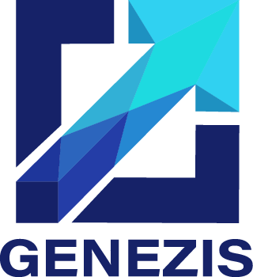

# Sistema Integral de Turnos Médicos | Grupo GENEZIS - COHORTE 2024





**Genezis** es una aplicación de escritorio desarrollada en **Python** con una interfaz gráfica intuitiva basada en **Tkinter**, que permite a diferentes actores del sistema de salud gestionar turnos médicos de forma eficiente. Está diseñada utilizando el patrón de arquitectura **MVC** (Modelo - Vista - Controlador), conectada a una base de datos **PostgreSQL** alojada en **Supabase**.

Este sistema fue desarrollado como proyecto académico por un equipo de estudiantes universitarios y está dividido en módulos independientes por tipo de usuario: administradores, médicos, pacientes e instituciones.

---

## 🎯 Objetivo del proyecto

El propósito principal de Genezis es ofrecer un entorno centralizado donde:

* Las instituciones puedan organizar a sus médicos y turnos disponibles.
* Los médicos gestionen su agenda, disponibilidad y pacientes.
* Los pacientes puedan solicitar, cancelar y consultar sus turnos.
* El administrador general del sistema tenga control y estadísticas sobre todo lo que ocurre.

Está pensado para ser escalable y adaptable a instituciones reales.

---

## 📌 Funcionalidades generales

* Registro y login de usuarios con rol asignado.
* Diferenciación de vistas y permisos por rol (admin, médico, paciente, institución).
* Gestión de horarios y agenda médica.
* Turnos con fechas y horarios específicos (no solo días de semana).
* Historial clínico por paciente.
* Alta, baja y edición de usuarios, médicos, instituciones y especialidades.
* Control visual desde paneles tipo dashboard.

---

## 🛠️ Tecnologías utilizadas

| Herramienta       | Descripción                            |
| ----------------- | -------------------------------------- |
| **Python 3.12**   | Lenguaje principal del backend y la UI |
| **Tkinter**       | Biblioteca para interfaces gráficas    |
| **PostgreSQL**    | Base de datos relacional               |
| **Supabase**      | Backend as a Service (DB y API REST)   |
| **.env / dotenv** | Manejo seguro de credenciales          |
| **Git + GitHub**  | Control de versiones y colaboración    |

---

## 🧱 Arquitectura del Proyecto (MVC)

* **Modelo (Model):**

  * Tablas de base de datos diseñadas en Supabase.
  * Relaciones entre usuarios, médicos, pacientes, turnos, etc.

* **Vista (View):**

  * Interfaces diseñadas en Tkinter, separadas por tipo de usuario.
  * Todas ubicadas dentro de `/ui/`.

* **Controlador (Controller):**

  * Código Python que conecta la vista con Supabase.
  * Responsable de la lógica de negocio (alta, baja, validación, queries).

---

## 📁 Estructura del Proyecto

```bash
.
├── controllers/                  # Controladores del sistema (lógica de negocio)
│   ├── admin_controller.py
│   ├── auth_controller.py
│   ├── inst_controller.py
│   ├── med_controller.py
│   └── pac_controller.py
├── database/                     # Conexión y modelos DB
│   ├── db_manager.py
│   └── models.py
├── ui/                           # Interfaz gráfica (Tkinter)
│   ├── admin/
│   │   ├── dashboard.py
│   │   ├── reports.py
│   │   └── users.py
│   ├── common/
│   │   ├── assets/
│   │   ├── utils.py
│   │   └── widgets.py
│   ├── institucion/
│   │   ├── agenda.py
│   │   ├── config.py
│   │   ├── dashboard.py
│   │   ├── horarios.py
│   │   └── medicos.py
│   ├── medicos/
│   │   ├── agenda.py
│   │   ├── dashboard.py
│   │   ├── datosMedico.py
│   │   ├── horarios.py
│   │   └── pacientes.py
│   ├── pacientes/
│   │   ├── app.py
│   │   ├── login.py
│   │   ├── loginInterface.py
│   │   └── register.py
├── utils/
│   ├── config.py
│   └── env/
├── .env
├── main.py
├── README.md
├── logo-genezis-new.png
├── requirements.txt
└── test_connection.py
```

---

## 🗃️ Diseño de Base de Datos (Supabase / PostgreSQL)

### Tablas principales:

| Tabla                  | Descripción                                              |
| ---------------------- | -------------------------------------------------------- |
| `usuarios`             | Contiene datos base (nombre, mail, tipo de usuario)      |
| `medicos`              | Relacionado a usuarios, incluye especialidad y matrícula |
| `pacientes`            | Datos personales, obra social, relación con usuarios     |
| `turnos`               | Fecha, hora, estado y notas, médico y paciente           |
| `horarios_disponibles` | Días/horarios donde el médico puede atender              |
| `especialidades`       | Lista predeterminada de especialidades médicas           |

Relaciones principales:

* `medicos.usuario_id` → `usuarios.id`
* `pacientes.usuario_id` → `usuarios.id`
* `turnos.medico_id` → `medicos.id`
* `turnos.paciente_id` → `pacientes.id`

---

## 👤 Panel Médico - Funcionalidades Detalladas

* Visualización de turnos del día actual.
* Confirmar o cancelar turnos.
* Establecer nuevos horarios de disponibilidad.
* Validación para evitar superposición de horarios.
* Edición de horarios existentes.
* Consulta del historial de turnos de cada paciente.

### Validaciones implementadas:

* No permitir guardar horarios duplicados.
* Mostrar mensaje claro si ya existe un turno igual.
* Validar que hora de fin sea posterior a la de inicio.

---

## 🧪 ¿Cómo ejecutar el sistema localmente?

### 1. Clonar el repositorio

```bash
git clone https://github.com/usuario/genezis-turnos-medicos.git
cd genezis-turnos-medicos
```

### 2. Crear un entorno virtual y activarlo

```bash
python -m venv .venv
# En Windows:
.venv\Scripts\activate
# En macOS/Linux:
source .venv/bin/activate
```

### 3. Instalar las dependencias

```bash
pip install -r requirements.txt
```

### 4. Configurar tu archivo `.env`

```env
SUPABASE_URL=https://xxxxx.supabase.co
SUPABASE_KEY=your-service-role-key
```

### 5. Ejecutar la aplicación

```bash
python main.py
```

---

## 👥 Equipo de desarrollo

| Integrante        | Rol                  |
|-------------------| -------------------- |
| Luciano Cortez    | Módulo Institución   |
| Gabriel Garino    | Módulo Institución   |
| Nicolás Fernandez | Módulo Médico        |
| Fernando Alma     | Módulo Médico        |
| Marcos Rodriguez  | Módulo Paciente      |
| Brisa Salvatierra | Módulo Paciente      |
| Javier Quiroga    | Panel Administrativo |

---

## 🚀 Mejoras futuras (Backlog)

* 🔔 Notificaciones de turnos por email o SMS
* 📅 Vista de calendario general por especialidad
* 📊 Panel de estadísticas y reportes para admins
* 🌐 Exportación e importación de datos
* 🧑‍💼 Gestión de usuarios por parte de admins
* 🌍 Multi-idioma (ES, EN, etc.)
* 🖥️ Versión web en React o Flutter (Fase 3)

---

## 📆 Timeline del Proyecto

| Fase     | Fecha                       | Tareas principales                                  |
| -------- |-----------------------------| --------------------------------------------------- |
| Sprint 1 | Mayo 2025                   | Login, módulo médico, conexión Supabase             |
| Sprint 2 | Primer Quincena Junio 2025  | Módulo pacientes, edición de horarios, validaciones |
| Sprint 3 | Segunda Quincena Junio 2025 | Panel administrador, pruebas, mejoras visuales      |

---

## 📄 Licencia

Este proyecto está bajo la **Licencia MIT**. Podés usarlo, modificarlo y compartirlo libremente.

---

## 🧩 Diagramas del Sistema

### 📊 Diagrama Entidad-Relación (DER)


### 🧱 Diagrama UML de Clases


---

> Para cualquier consulta técnica o colaboración, contactanos a través del repositorio o vía mail.

---

Gracias por usar **Genezis** 💙

# Integrantes de Genezis: 

1. Brisa Salvatierra
2. Javier Quiroga
3. Fernando Alma
4. Gabriel Garino
5. Marcos Rodriguez
6. Luciano Cortez
7. Nicolas Fernandez

